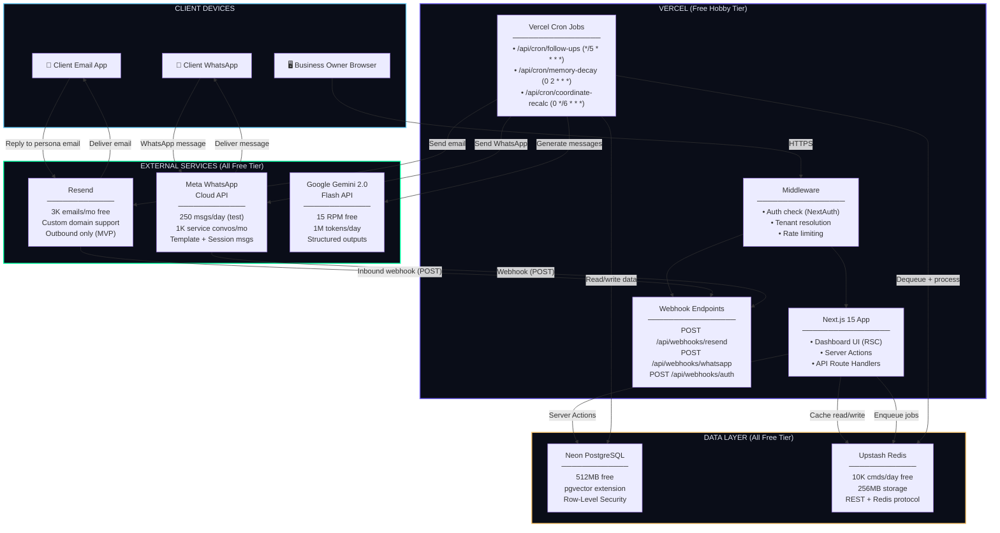
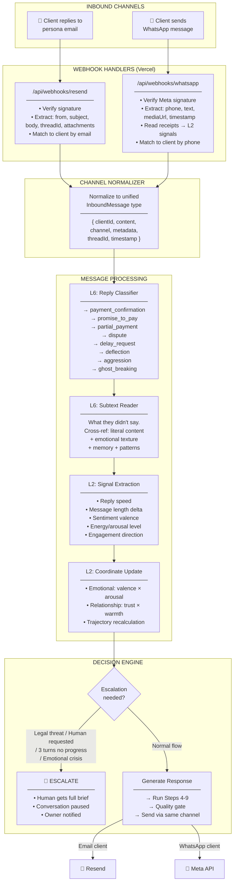
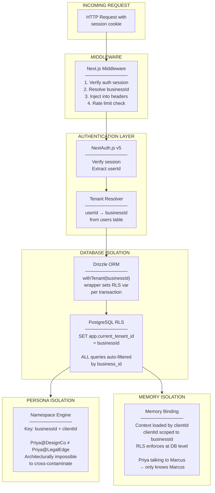
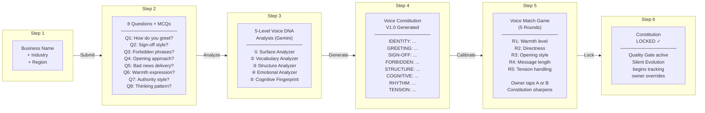
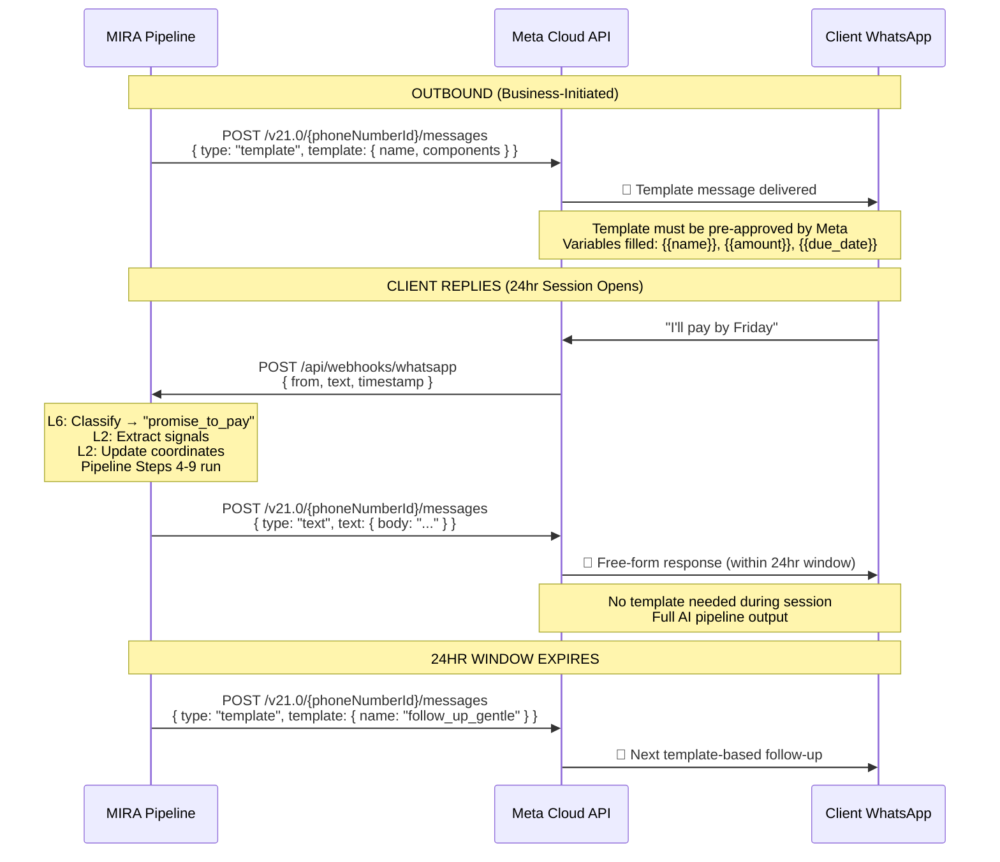

# MIRA — AI Business Representative

## Complete Architecture & Implementation Plan

> The world's first AI that speaks in your voice, feels your clients, and recovers your money.

---

## 1. System Deployment Architecture



---

## 2. Six-Layer AI Engine Architecture

```mermaid
graph TB
    subgraph L1["L1 — BRAND VOICE #00ffa3"]
        direction LR
        L1A["Surface<br/>Analyzer"]
        L1B["Vocabulary<br/>Analyzer"]
        L1C["Structure<br/>Analyzer"]
        L1D["Emotional<br/>Analyzer"]
        L1E["Cognitive<br/>Fingerprint"]
        L1F["Silent<br/>Evolution"]
        L1G["Voice<br/>Constitution"]
        L1H["Quality<br/>Gate"]
        
        L1A --> L1G
        L1B --> L1G
        L1C --> L1G
        L1D --> L1G
        L1E --> L1G
        L1F -.->|"updates"| L1G
        L1G --> L1H
    end

    subgraph L2["L2 — BEHAVIORAL INTELLIGENCE #7c6dfa"]
        direction LR
        L2A["Signal<br/>Collector"]
        L2B["5-Dimension<br/>Extractor"]
        L2C["Coordinate<br/>Plotter"]
        L2D["Possibility<br/>Space"]
        L2E["Ruleless<br/>Intuition"]
        L2F["Movement<br/>Tracker"]
        L2G["Resolution<br/>Scorer"]
        
        L2A --> L2B
        L2B --> L2C
        L2C --> L2D
        L2D --> L2E
        L2E --> L2F
        L2F --> L2G
    end

    subgraph L3["L3 — PERSONA #fa6d6d"]
        direction LR
        L3A["Name + Role<br/>Engine"]
        L3B["Personality<br/>Anchor"]
        L3C["Rhythm<br/>Variation"]
        L3D["Vocabulary<br/>Unpredictability"]
        L3E["Micro<br/>Naturalness"]
        L3F["Contextual<br/>Emotion"]
        L3G["Namespace<br/>Isolation"]
        L3H["Persona<br/>Constitution"]
        
        L3A --> L3B
        L3B --> L3H
        L3C --> L3H
        L3D --> L3H
        L3E --> L3H
        L3F --> L3H
        L3G -.->|"enforces"| L3H
    end

    subgraph L4["L4 — RELATIONSHIP MEMORY #fac46d"]
        direction LR
        L4A["Core<br/>Memory"]
        L4B["Recent<br/>Memory"]
        L4C["Episodic<br/>Memory"]
        L4D["Human Detail<br/>Memory"]
        L4E["Relevance<br/>Scorer"]
        L4F["Decay<br/>Engine"]
        L4G["Refresh<br/>Trigger"]
        L4H["Integrity<br/>Checker"]
        
        L4A --> L4E
        L4B --> L4E
        L4C --> L4E
        L4D --> L4E
        L4E --> L4H
        L4F -.->|"expires"| L4B
        L4F -.->|"compresses"| L4C
        L4G -.->|"triggers"| L4E
    end

    subgraph L5["L5 — ETHICAL TRANSPARENCY #6dcffa"]
        direction LR
        L5A["Structural<br/>Honesty"]
        L5B["Graceful<br/>Disclosure"]
        L5C["Disclosure<br/>Control"]
        L5D["Legal<br/>Compliance"]
        L5E["Trust<br/>Dividend"]
        
        L5A --> L5B
        L5C --> L5B
        L5D --> L5B
        L5B --> L5E
    end

    subgraph L6["L6 — TWO-WAY CONVERSATION #d46dfa"]
        direction LR
        L6A["Reply<br/>Classifier"]
        L6B["Subtext<br/>Reader"]
        L6C["Response<br/>Protocol"]
        L6D["Negotiation<br/>Engine"]
        L6E["Thread<br/>Context"]
        L6F["Escalation<br/>Engine"]
        L6G["Closure<br/>Engine"]
        
        L6A --> L6B
        L6B --> L6C
        L6C --> L6D
        L6D --> L6E
        L6E --> L6F
        L6F --> L6G
    end

    subgraph CONVERGENCE["CONVERGENCE PIPELINE"]
        direction LR
        ORCH["Pipeline<br/>Orchestrator"]
        CHANNEL["Channel<br/>Router"]
        
        ORCH --> CHANNEL
    end

    L1 --> CONVERGENCE
    L2 --> CONVERGENCE
    L3 --> CONVERGENCE
    L4 --> CONVERGENCE
    L5 --> CONVERGENCE
    L6 --> CONVERGENCE

    CHANNEL -->|"Email"| EMAIL_OUT["📧 Resend"]
    CHANNEL -->|"WhatsApp"| WA_OUT["📱 Meta API"]
```



---

## 3. End-to-End Convergence Pipeline (Steps 0–16)

```mermaid
flowchart TD
    S0["⓪ TRIGGER<br/>Invoice overdue detected<br/><i>System</i>"]
    S1["① MEMORY LOAD<br/>Core + Recent + Episodic + Human Detail<br/>Integrity check → exclude stale<br/><i>L4</i>"]
    S2["② EMOTIONAL COORDINATE<br/>5-dimension extractor on all signals<br/>Plot valence × arousal<br/><i>L2</i>"]
    S3["③ RELATIONSHIP COORDINATE<br/>Trust × Warmth positioned<br/>Trajectory checked<br/><i>L2</i>"]
    S4["④ POSSIBILITY SPACE<br/>Expander + Emotional Filter<br/>What is genuinely possible now<br/><i>L2</i>"]
    S5["⑤ RULELESS INTUITION<br/>Full context → Gemini, no rules<br/>Strategy emerges from understanding<br/><i>L2</i>"]
    S6["⑥ PERSONA ACTIVATION<br/>Identity loaded, namespace confirmed<br/>Human texture engines ready<br/><i>L3</i>"]
    S7["⑦ ETHICAL CHECK<br/>Disclosure level applied<br/>Jurisdiction requirements active<br/><i>L5</i>"]
    S8["⑧ VOICE APPLICATION<br/>Voice Constitution governs generation<br/>Rhythm + vocabulary + fingerprint<br/><i>L1</i>"]
    S9["⑨ QUALITY GATE<br/>Voice Constitution ✓ Persona Constitution ✓<br/>Fail → regenerate (max 3)<br/><i>L1 + L3</i>"]
    S10["⑩ CHANNEL ROUTE + SEND<br/>Email via Resend OR WhatsApp via Meta<br/>Based on client preference<br/><i>Infrastructure</i>"]

    S0 --> S1 --> S2 --> S3 --> S4 --> S5 --> S6 --> S7 --> S8 --> S9

    S9 -->|"PASS"| S10
    S9 -->|"FAIL (< 3)"| S8
    S9 -->|"FAIL (≥ 3)"| HUMAN_REVIEW["🚨 Human Review"]

    S10 --> WAIT["⏳ WAIT FOR REPLY"]

    WAIT --> S11["⑪ REPLY RECEIVED<br/>Classify reply type (8 types)<br/>All layers activate<br/><i>L6</i>"]
    S11 --> S12["⑫ RESPONSE PROTOCOL<br/>Acknowledge → Subtext → Forward<br/>→ Door open → Voice applied<br/><i>L6</i>"]
    S12 --> S13["⑬ COORDINATE UPDATE<br/>Movement toward or away from target?<br/>Recalibrate if away<br/><i>L2</i>"]
    S13 --> S14["⑭ MEMORY UPDATE<br/>Human details stored<br/>Relevance rescored, decay reset<br/><i>L4</i>"]
    S14 --> S15["⑮ RESOLUTION SCORE<br/>Genuine vs Coincidental vs Painful<br/>System learns<br/><i>All Layers</i>"]
    S15 --> S16["⑯ CLOSURE<br/>Relationship strengthened<br/>Bridge to future<br/><i>L6</i>"]

    S16 -->|"Not resolved"| WAIT
    S16 -->|"Resolved"| DONE["✅ RESOLVED"]

    style S0 fill:#111420,stroke:#fff,color:#dde2f0
    style S1 fill:#111420,stroke:#fac46d,color:#dde2f0
    style S2 fill:#111420,stroke:#7c6dfa,color:#dde2f0
    style S3 fill:#111420,stroke:#7c6dfa,color:#dde2f0
    style S4 fill:#111420,stroke:#7c6dfa,color:#dde2f0
    style S5 fill:#111420,stroke:#7c6dfa,color:#dde2f0
    style S6 fill:#111420,stroke:#fa6d6d,color:#dde2f0
    style S7 fill:#111420,stroke:#6dcffa,color:#dde2f0
    style S8 fill:#111420,stroke:#00ffa3,color:#dde2f0
    style S9 fill:#111420,stroke:#00ffa3,color:#dde2f0
    style S10 fill:#111420,stroke:#fff,color:#dde2f0
    style S11 fill:#111420,stroke:#d46dfa,color:#dde2f0
    style S12 fill:#111420,stroke:#d46dfa,color:#dde2f0
    style S13 fill:#111420,stroke:#7c6dfa,color:#dde2f0
    style S14 fill:#111420,stroke:#fac46d,color:#dde2f0
    style S15 fill:#111420,stroke:#fff,color:#dde2f0
    style S16 fill:#111420,stroke:#d46dfa,color:#dde2f0
```



---

## 4. Inbound Message Processing Flow



---

## 5. Database Entity Relationship Diagram

```mermaid
erDiagram
    BUSINESS ||--o| VOICE_CONSTITUTION : has
    BUSINESS ||--o| PERSONA : has
    BUSINESS ||--o| NEGOTIATION_PARAMS : has
    BUSINESS ||--o| EMAIL_DOMAIN : has
    BUSINESS ||--o| WHATSAPP_CONFIG : has
    BUSINESS ||--o{ CLIENT : owns
    BUSINESS ||--o{ WHATSAPP_TEMPLATE : defines
    BUSINESS ||--o{ USER : has_members

    CLIENT ||--o{ CONVERSATION : participates_in
    CLIENT ||--o{ INVOICE : billed_via
    CLIENT ||--o{ MEMORY : remembered_by
    CLIENT ||--o{ BEHAVIORAL_SIGNAL : emits
    CLIENT ||--o| CLIENT_COORDINATE : tracked_at

    CONVERSATION ||--o{ MESSAGE : contains
    CONVERSATION |o--o| INVOICE : about

    VOICE_CONSTITUTION ||--o{ VOICE_EVOLUTION_LOG : evolves_via

    BUSINESS {
        text id PK
        text name
        text industry
        varchar region
        boolean onboarding_complete
        enum disclosure_level
    }

    USER {
        text id PK
        text email UK
        text name
        text business_id FK
        varchar role
    }

    VOICE_CONSTITUTION {
        text id PK
        text business_id FK_UK
        real version
        boolean locked
        jsonb surface_profile
        jsonb vocabulary_profile
        jsonb structure_profile
        jsonb emotional_profile
        jsonb cognitive_fingerprint
        jsonb onboarding_answers
        jsonb voice_match_results
    }

    VOICE_EVOLUTION_LOG {
        text id PK
        text constitution_id FK
        real previous_version
        real new_version
        jsonb diff_analysis
        varchar triggered_by
    }

    PERSONA {
        text id PK
        text business_id FK_UK
        text name
        text role
        text email
        jsonb traits
        jsonb constitution
    }

    CLIENT {
        text id PK
        text business_id FK
        text name
        text email
        text phone
        text company
        enum preferred_channel
        jsonb owner_overrides
    }

    CLIENT_COORDINATE {
        text id PK
        text client_id FK
        real emotional_valence
        real emotional_arousal
        real trust_level
        real warmth_level
        enum trajectory
        jsonb movement_history
    }

    BEHAVIORAL_SIGNAL {
        text id PK
        text client_id FK
        varchar signal_type
        jsonb signal_data
        jsonb dimensions
    }

    MEMORY {
        text id PK
        text client_id FK
        enum layer
        text content
        jsonb structured_data
        vector embedding
        real relevance_score
        real recency_weight
        real frequency_weight
        real emotional_weight
        enum decay_rate
        timestamp expires_at
    }

    CONVERSATION {
        text id PK
        text client_id FK
        text invoice_id FK
        enum status
        enum channel
        boolean escalated_to_human
        varchar resolution_type
    }

    MESSAGE {
        text id PK
        text conversation_id FK
        enum direction
        enum channel
        text content
        text email_message_id
        text whatsapp_message_id
        text thread_id
        varchar reply_type
        jsonb subtext_analysis
        jsonb pipeline_log
        boolean quality_gate_pass
        integer regenerations
        jsonb coordinate_snapshot
    }

    INVOICE {
        text id PK
        text client_id FK
        real amount
        varchar currency
        timestamp due_date
        enum status
        timestamp paid_at
    }

    NEGOTIATION_PARAMS {
        text id PK
        text business_id FK_UK
        integer max_extension_days
        boolean instalment_allowed
        real instalment_min_amount
        real dispute_auto_threshold
    }

    EMAIL_DOMAIN {
        text id PK
        text business_id FK_UK
        text domain
        boolean verified
        boolean dkim_pending
    }

    WHATSAPP_CONFIG {
        text id PK
        text business_id FK_UK
        text phone_number_id
        text waba_id
        text access_token
        boolean verified
    }

    WHATSAPP_TEMPLATE {
        text id PK
        text business_id FK
        text template_name
        varchar category
        text body_text
        jsonb variables
        varchar status
    }
```

---

## 6. Multi-Tenancy Isolation



---

## 7. Onboarding Flow (L1 Voice Constitution)



---

## $0 Tech Stack — Final

| Layer | Technology | Free Tier Limit | Role in MIRA |
|-------|-----------|-----------------|-------------|
| **Framework** | Next.js 15 (App Router) | Open source | Dashboard, API, Webhooks |
| **Language** | TypeScript (strict) | Open source | Full stack type safety |
| **Auth** | NextAuth v5 | Open source | Session management, OAuth |
| **Database** | Neon PostgreSQL + pgvector | 512MB, 0.25 CU | All data + vector embeddings |
| **ORM** | Drizzle ORM | Open source | Type-safe queries, migrations |
| **Cache** | Upstash Redis | 10K cmds/day, 256MB | Job queue, hot cache |
| **AI Engine** | Google Gemini 2.0 Flash | 15 RPM, 1M tokens/day | All AI generation + analysis |
| **Email** | Resend | 3K emails/month | Outbound persona emails |
| **WhatsApp** | Meta Cloud API | 250 msgs/day (test) | Follow-ups + conversations |
| **Validation** | Zod | Open source | Runtime type checking |
| **UI** | Tailwind + shadcn/ui | Open source | Dashboard components |
| **Hosting** | Vercel Hobby | 100GB BW, 10s fn | Frontend + API + Cron |
| **Monitoring** | Sentry Free | 5K errors/month | Error tracking |
| **Total** | | | **$0/month** |

> [!IMPORTANT]
> **Workers Architecture (No Railway)**: To keep $0, we replace persistent BullMQ workers with **Vercel Cron Jobs** that run as serverless functions. Follow-ups run every 5 minutes, memory decay runs nightly. The trade-off is ~5 min max delay instead of real-time processing. For an MVP, this is perfectly acceptable.

---

## Folder Structure

```
MIRA/
├── .env.example
├── .env.local                            # git-ignored
├── .gitignore
├── package.json
├── tsconfig.json
├── next.config.ts
├── drizzle.config.ts                     # Drizzle ORM configuration
├── tailwind.config.ts
├── components.json                       # shadcn/ui configuration
├── docker-compose.yml                    # Local dev: PostgreSQL + Redis
│
├── drizzle/                              # ═══ DATABASE ═══
│   ├── schema.ts                         # All table definitions
│   ├── relations.ts                      # Table relations
│   ├── seed.ts                           # Development seed data
│   ├── rls.sql                           # Row-Level Security policies
│   └── migrations/                       # Auto-generated SQL
│
├── public/
│   ├── fonts/                            # Bebas Neue, IBM Plex Mono, Fraunces
│   └── images/
│
├── src/
│   ├── middleware.ts                     # Auth + tenant resolution + rate limit
│   │
│   ├── app/                              # ═══ ROUTES (thin — logic in features/) ═══
│   │   ├── layout.tsx                    # Root: fonts, theme, session provider
│   │   ├── page.tsx                      # Landing page
│   │   ├── globals.css                   # Tailwind base + design tokens
│   │   │
│   │   ├── (auth)/
│   │   │   ├── login/page.tsx
│   │   │   ├── signup/page.tsx
│   │   │   └── layout.tsx
│   │   │
│   │   ├── (dashboard)/
│   │   │   ├── layout.tsx                # Shell: sidebar, header, nav
│   │   │   ├── page.tsx                  # Home: metrics, activity feed
│   │   │   │
│   │   │   ├── onboarding/
│   │   │   │   ├── page.tsx              # L1: Entry + progress
│   │   │   │   ├── questions/page.tsx    # 8 questions + MCQs
│   │   │   │   ├── voice-match/page.tsx  # 5-round calibration
│   │   │   │   └── review/page.tsx       # Constitution review & lock
│   │   │   │
│   │   │   ├── persona/
│   │   │   │   ├── page.tsx              # L3: Name, role, traits
│   │   │   │   └── preview/page.tsx      # Live message preview
│   │   │   │
│   │   │   ├── clients/
│   │   │   │   ├── page.tsx              # Client list + coordinates
│   │   │   │   └── [clientId]/
│   │   │   │       ├── page.tsx          # Detail: memory, coords, history
│   │   │   │       ├── conversations/page.tsx
│   │   │   │       └── overrides/page.tsx
│   │   │   │
│   │   │   ├── conversations/
│   │   │   │   ├── page.tsx              # All active conversations
│   │   │   │   └── [conversationId]/page.tsx
│   │   │   │
│   │   │   ├── invoices/
│   │   │   │   ├── page.tsx
│   │   │   │   └── [invoiceId]/page.tsx
│   │   │   │
│   │   │   ├── settings/
│   │   │   │   ├── page.tsx              # General
│   │   │   │   ├── voice/page.tsx        # Voice constitution editor
│   │   │   │   ├── persona/page.tsx      # Persona config
│   │   │   │   ├── transparency/page.tsx # L5: Disclosure level
│   │   │   │   ├── negotiation/page.tsx  # Payment parameters
│   │   │   │   ├── email/page.tsx        # Domain + DNS verification
│   │   │   │   └── whatsapp/page.tsx     # WhatsApp number + templates
│   │   │   │
│   │   │   └── analytics/page.tsx        # Recovery rates, distributions
│   │   │
│   │   └── api/
│   │       ├── auth/[...nextauth]/route.ts
│   │       │
│   │       ├── webhooks/
│   │       │   ├── resend/route.ts           # Inbound email
│   │       │   ├── whatsapp/route.ts         # Meta webhook verify + messages
│   │       │   └── payment/route.ts          # Payment confirmations
│   │       │
│   │       └── cron/                         # Vercel Cron (replaces BullMQ workers)
│   │           ├── follow-ups/route.ts       # */5 * * * * — check & send follow-ups
│   │           ├── memory-decay/route.ts     # 0 2 * * * — nightly decay + compress
│   │           ├── coordinate-recalc/route.ts # 0 */6 * * * — batch recalculation
│   │           └── silent-evolution/route.ts  # 0 3 * * 0 — weekly voice evolution
│   │
│   ├── features/                         # ═══ DOMAIN LOGIC ═══
│   │   │
│   │   ├── ai/                           # 🧠 AI Integration
│   │   │   ├── gemini-client.ts          # Google Generative AI SDK wrapper
│   │   │   ├── prompt-builder.ts         # Context assembly (persona + memory + thread)
│   │   │   ├── quality-gate.ts           # Voice + Persona compliance check
│   │   │   ├── types.ts
│   │   │   └── prompts/
│   │   │       ├── voice-analysis.ts         # L1: Voice DNA from answers
│   │   │       ├── voice-match.ts            # L1: A/B message pairs
│   │   │       ├── constitution-gen.ts       # L1: Answers → constitution
│   │   │       ├── signal-extraction.ts      # L2: 5-dimension extraction
│   │   │       ├── intuition.ts              # L2: Ruleless — full context, no rules
│   │   │       ├── subtext-reading.ts        # L6: What they didn't say
│   │   │       ├── reply-classify.ts         # L6: 8 reply type classification
│   │   │       ├── message-generate.ts       # Pipeline: outbound message gen
│   │   │       └── negotiation.ts            # L6: Parameter-bound negotiation
│   │   │
│   │   ├── voice/                        # 🎙️ L1: Brand Voice
│   │   │   ├── services/
│   │   │   │   ├── surface-analyzer.ts
│   │   │   │   ├── vocabulary-analyzer.ts
│   │   │   │   ├── structure-analyzer.ts
│   │   │   │   ├── emotional-analyzer.ts
│   │   │   │   ├── cognitive-fingerprint.ts
│   │   │   │   ├── silent-evolution.ts
│   │   │   │   └── constitution.ts
│   │   │   ├── components/
│   │   │   │   ├── QuestionStep.tsx
│   │   │   │   ├── VoiceMatchRound.tsx
│   │   │   │   ├── ConstitutionPreview.tsx
│   │   │   │   └── VoiceMatchProgress.tsx
│   │   │   ├── actions/
│   │   │   │   ├── submit-answers.ts
│   │   │   │   ├── submit-voice-match.ts
│   │   │   │   └── lock-constitution.ts
│   │   │   └── types.ts
│   │   │
│   │   ├── behavioral/                   # 📊 L2: Behavioral Intelligence
│   │   │   ├── services/
│   │   │   │   ├── signal-collector.ts
│   │   │   │   ├── dimension-extractor.ts
│   │   │   │   ├── coordinate-plotter.ts
│   │   │   │   ├── possibility-space.ts
│   │   │   │   ├── intuition-engine.ts
│   │   │   │   ├── movement-tracker.ts
│   │   │   │   └── resolution-scorer.ts
│   │   │   ├── components/
│   │   │   │   ├── CoordinateGraph.tsx
│   │   │   │   ├── RelationshipGraph.tsx
│   │   │   │   ├── TrajectoryIndicator.tsx
│   │   │   │   └── SignalFeed.tsx
│   │   │   └── types.ts
│   │   │
│   │   ├── persona/                      # 🎭 L3: Persona
│   │   │   ├── services/
│   │   │   │   ├── identity.ts
│   │   │   │   ├── personality-anchor.ts
│   │   │   │   ├── rhythm-variation.ts
│   │   │   │   ├── vocabulary-unpredictability.ts
│   │   │   │   ├── micro-naturalness.ts
│   │   │   │   ├── contextual-emotion.ts
│   │   │   │   ├── namespace.ts
│   │   │   │   └── persona-constitution.ts
│   │   │   ├── components/
│   │   │   │   ├── PersonaCard.tsx
│   │   │   │   ├── TraitBadges.tsx
│   │   │   │   └── PersonaPreview.tsx
│   │   │   ├── actions/
│   │   │   │   └── configure-persona.ts
│   │   │   └── types.ts
│   │   │
│   │   ├── memory/                       # 🧠 L4: Relationship Memory
│   │   │   ├── services/
│   │   │   │   ├── core-memory.ts
│   │   │   │   ├── recent-memory.ts
│   │   │   │   ├── episodic-memory.ts
│   │   │   │   ├── human-detail-memory.ts
│   │   │   │   ├── relevance-scorer.ts
│   │   │   │   ├── decay-engine.ts
│   │   │   │   ├── refresh-trigger.ts
│   │   │   │   └── integrity-checker.ts
│   │   │   ├── components/
│   │   │   │   ├── MemoryTimeline.tsx
│   │   │   │   ├── MemoryLayerView.tsx
│   │   │   │   └── AddMemoryForm.tsx
│   │   │   ├── actions/
│   │   │   │   ├── add-memory.ts
│   │   │   │   └── update-override.ts
│   │   │   └── types.ts
│   │   │
│   │   ├── ethics/                       # ⚖️ L5: Ethical Transparency
│   │   │   ├── services/
│   │   │   │   ├── structural-honesty.ts
│   │   │   │   ├── graceful-disclosure.ts
│   │   │   │   ├── disclosure-control.ts
│   │   │   │   ├── legal-compliance.ts
│   │   │   │   └── trust-dividend.ts
│   │   │   ├── components/
│   │   │   │   └── DisclosurePicker.tsx
│   │   │   ├── actions/
│   │   │   │   └── set-disclosure-level.ts
│   │   │   └── types.ts
│   │   │
│   │   ├── conversation/                 # 💬 L6: Two-Way Conversation
│   │   │   ├── services/
│   │   │   │   ├── reply-classifier.ts
│   │   │   │   ├── subtext-reader.ts
│   │   │   │   ├── response-protocol.ts
│   │   │   │   ├── negotiation-engine.ts
│   │   │   │   ├── thread-context.ts
│   │   │   │   ├── escalation-engine.ts
│   │   │   │   └── closure-engine.ts
│   │   │   ├── components/
│   │   │   │   ├── MessageBubble.tsx
│   │   │   │   ├── ConversationThread.tsx
│   │   │   │   ├── ReplyClassBadge.tsx
│   │   │   │   ├── EscalationBanner.tsx
│   │   │   │   └── NegotiationParams.tsx
│   │   │   ├── actions/
│   │   │   │   ├── override-message.ts
│   │   │   │   └── escalate.ts
│   │   │   └── types.ts
│   │   │
│   │   ├── channels/                     # 📡 Multi-Channel Layer
│   │   │   ├── types.ts                  # InboundMessage, OutboundMessage, Channel
│   │   │   ├── channel-router.ts         # Route to email or WhatsApp
│   │   │   ├── email/
│   │   │   │   ├── resend-client.ts      # Resend SDK wrapper
│   │   │   │   ├── send.ts              # Send email from persona
│   │   │   │   ├── receive.ts           # Parse inbound webhook
│   │   │   │   ├── domain-setup.ts      # DNS/DKIM verification
│   │   │   │   └── thread-tracker.ts    # Email thread management
│   │   │   └── whatsapp/
│   │   │       ├── meta-client.ts        # Meta Cloud API wrapper
│   │   │       ├── send-template.ts      # Approved template messages
│   │   │       ├── send-session.ts       # Free-form within 24hr window
│   │   │       ├── receive.ts           # Parse webhook payload
│   │   │       └── template-manager.ts  # Template CRUD + status
│   │   │
│   │   └── pipeline/                     # 🔄 Convergence Pipeline
│   │       ├── outbound-pipeline.ts      # Steps 0-10
│   │       ├── inbound-pipeline.ts       # Steps 11-16
│   │       ├── pipeline-orchestrator.ts  # Coordinates all 6 layers
│   │       └── types.ts                  # PipelineContext, PipelineStep
│   │
│   ├── lib/                              # ═══ SHARED INFRASTRUCTURE ═══
│   │   ├── db/
│   │   │   ├── index.ts                  # Drizzle client singleton
│   │   │   └── tenant.ts                # withTenant() wrapper for RLS
│   │   ├── redis/
│   │   │   └── index.ts                  # Upstash Redis client
│   │   ├── auth/
│   │   │   ├── config.ts                # NextAuth configuration
│   │   │   └── helpers.ts               # getCurrentUser(), requireAuth()
│   │   └── utils/
│   │       ├── errors.ts
│   │       ├── validators.ts             # Zod schemas
│   │       ├── formatters.ts
│   │       └── logger.ts                # Pino structured logging
│   │
│   ├── components/                       # ═══ SHARED UI ═══
│   │   ├── ui/                           # shadcn/ui primitives
│   │   │   ├── button.tsx
│   │   │   ├── input.tsx
│   │   │   ├── card.tsx
│   │   │   ├── dialog.tsx
│   │   │   ├── badge.tsx
│   │   │   ├── toast.tsx
│   │   │   ├── skeleton.tsx
│   │   │   ├── tabs.tsx
│   │   │   ├── dropdown-menu.tsx
│   │   │   └── data-table.tsx
│   │   ├── layout/
│   │   │   ├── Sidebar.tsx
│   │   │   ├── Header.tsx
│   │   │   └── BreadcrumbNav.tsx
│   │   └── shared/
│   │       ├── MetricCard.tsx
│   │       ├── ActivityFeed.tsx
│   │       ├── StatusDot.tsx
│   │       └── EmptyState.tsx
│   │
│   ├── hooks/
│   │   ├── use-onboarding.ts
│   │   ├── use-conversation.ts
│   │   ├── use-coordinates.ts
│   │   └── use-realtime.ts
│   │
│   └── types/                            # Global TypeScript types
│       ├── voice.ts
│       ├── behavioral.ts
│       ├── persona.ts
│       ├── memory.ts
│       ├── conversation.ts
│       ├── pipeline.ts
│       └── api.ts
│
└── docs/
    ├── architecture.html                 # Original reference
    ├── api-reference.md
    ├── prompt-engineering.md
    └── deployment.md
```

**Total: ~75 files across 6 feature domains + infrastructure**

---

## Database Schema (Drizzle ORM)

> Full schema in [drizzle/schema.ts]. Key additions for WhatsApp shown below.

```typescript
// ═══════════════════════════════════════════
// CHANNEL SUPPORT (Email + WhatsApp)
// ═══════════════════════════════════════════

export const channelEnum = pgEnum('channel', ['EMAIL', 'WHATSAPP']);

// clients table — updated
export const clients = pgTable('clients', {
  id:               text('id').primaryKey(),
  businessId:       text('business_id').notNull().references(() => businesses.id),
  name:             text('name').notNull(),
  email:            text('email').notNull(),
  phone:            text('phone'),                                        // WhatsApp number
  company:          text('company'),
  preferredChannel: channelEnum('preferred_channel').default('EMAIL'),     // Route preference
  ownerOverrides:   jsonb('owner_overrides'),
  createdAt:        timestamp('created_at').defaultNow(),
  updatedAt:        timestamp('updated_at').defaultNow(),
});

// conversations table — updated
export const conversations = pgTable('conversations', {
  id:                text('id').primaryKey(),
  clientId:          text('client_id').notNull().references(() => clients.id),
  invoiceId:         text('invoice_id').references(() => invoices.id),
  channel:           channelEnum('channel').default('EMAIL'),              // Conversation channel
  status:            conversationStatusEnum('status').default('ACTIVE'),
  escalatedToHuman:  boolean('escalated_to_human').default(false),
  resolutionType:    varchar('resolution_type', { length: 20 }),
  createdAt:         timestamp('created_at').defaultNow(),
  updatedAt:         timestamp('updated_at').defaultNow(),
});

// messages table — updated
export const messages = pgTable('messages', {
  id:                  text('id').primaryKey(),
  conversationId:      text('conversation_id').notNull().references(() => conversations.id),
  direction:           messageDirectionEnum('direction').notNull(),
  channel:             channelEnum('channel').default('EMAIL'),            // Per-message channel
  content:             text('content').notNull(),
  emailMessageId:      text('email_message_id'),                          // Resend ID
  whatsappMessageId:   text('whatsapp_message_id'),                       // Meta message ID
  threadId:            text('thread_id'),
  replyType:           varchar('reply_type', { length: 30 }),
  subtextAnalysis:     jsonb('subtext_analysis'),
  pipelineLog:         jsonb('pipeline_log'),
  qualityGatePass:     boolean('quality_gate_pass'),
  regenerations:       integer('regenerations').default(0),
  coordinateSnapshot:  jsonb('coordinate_snapshot'),
  createdAt:           timestamp('created_at').defaultNow(),
});

// ═══════════════════════════════════════════
// WHATSAPP-SPECIFIC TABLES
// ═══════════════════════════════════════════

export const whatsappConfigs = pgTable('whatsapp_configs', {
  id:              text('id').primaryKey(),
  businessId:      text('business_id').notNull().unique().references(() => businesses.id),
  phoneNumberId:   text('phone_number_id').notNull(),     // Meta phone number ID
  wabaId:          text('waba_id').notNull(),              // WhatsApp Business Account ID
  accessToken:     text('access_token').notNull(),         // Encrypted
  verified:        boolean('verified').default(false),
  createdAt:       timestamp('created_at').defaultNow(),
});

export const whatsappTemplates = pgTable('whatsapp_templates', {
  id:             text('id').primaryKey(),
  businessId:     text('business_id').notNull().references(() => businesses.id),
  templateName:   text('template_name').notNull(),
  category:       varchar('category', { length: 20 }).notNull(),  // UTILITY | MARKETING
  language:       varchar('language', { length: 10 }).default('en'),
  headerText:     text('header_text'),
  bodyText:       text('body_text').notNull(),
  footerText:     text('footer_text'),
  variables:      jsonb('variables'),                              // {{1}}, {{2}} mappings
  status:         varchar('status', { length: 20 }).default('PENDING'),
  metaTemplateId: text('meta_template_id'),                        // After approval
  createdAt:      timestamp('created_at').defaultNow(),
  updatedAt:      timestamp('updated_at').defaultNow(),
});
```

---

## Pipeline Context Type

```typescript
// src/features/pipeline/types.ts

export type PipelineContext = {
  // ── Identity ──
  business: Business;
  client: Client;
  invoice: Invoice;
  persona: Persona;
  voiceConstitution: VoiceConstitution;

  // ── L4: Memory (Step 1) ──
  memories: {
    core: Memory[];
    recent: Memory[];
    episodic: Memory[];
    humanDetails: Memory[];
  };

  // ── L2: Coordinates (Steps 2-3) ──
  emotionalCoordinate: {
    valence: number;    // -1 to +1
    arousal: number;    // -1 to +1
    quadrant: 'angry_stressed' | 'excited_busy' | 'ashamed_withdrawn' | 'calm_trusting';
  };
  relationshipCoordinate: {
    trust: number;      // -1 to +1
    warmth: number;     // -1 to +1
    quadrant: 'ht_cold' | 'ht_warm' | 'lt_cold' | 'lt_warm';
  };

  // ── L2: Possibility Space (Step 4) ──
  possibilitySpace: {
    allowedApproaches: string[];
    forbiddenApproaches: string[];
    toneRange: { min: number; max: number };
    canMentionPayment: boolean;
    canOfferInstalment: boolean;
    canApplyPressure: boolean;
  };

  // ── L6: Conversation ──
  inboundMessage?: InboundMessage;   // null for initial outreach
  threadHistory: Message[];
  replyClassification?: ReplyType;
  subtextAnalysis?: SubtextResult;

  // ── Channel ──
  channel: 'EMAIL' | 'WHATSAPP';
  whatsappSessionActive?: boolean;    // Is 24hr window open?

  // ── L5: Ethics ──
  disclosureLevel: 'PROACTIVE' | 'REACTIVE' | 'FULL';

  // ── L6: Negotiation ──
  negotiationParams: NegotiationParams;

  // ── Output ──
  generatedMessage?: string;
  qualityGateResult?: {
    voicePass: boolean;
    personaPass: boolean;
    failures: string[];
  };

  // ── Audit ──
  pipelineLog: PipelineStep[];
};

export type ReplyType =
  | 'payment_confirmation'
  | 'promise_to_pay'
  | 'partial_payment'
  | 'dispute'
  | 'delay_request'
  | 'deflection'
  | 'aggression'
  | 'ghost_breaking';
```

---

## Channel Router Logic

```typescript
// src/features/channels/channel-router.ts

export async function routeMessage(ctx: PipelineContext): Promise<void> {
  const channel = resolveChannel(ctx);

  switch (channel) {
    case 'WHATSAPP':
      if (ctx.whatsappSessionActive) {
        // Within 24hr window → free-form message
        await sendWhatsAppSession(ctx);
      } else {
        // Outside window → must use approved template
        await sendWhatsAppTemplate(ctx);
      }
      break;

    case 'EMAIL':
      await sendEmail(ctx);
      break;
  }
}

function resolveChannel(ctx: PipelineContext): 'EMAIL' | 'WHATSAPP' {
  // 1. Client preference takes priority
  if (ctx.client.preferredChannel) return ctx.client.preferredChannel;

  // 2. If client has WhatsApp and no email → WhatsApp
  if (ctx.client.phone && !ctx.client.email) return 'WHATSAPP';

  // 3. If high urgency (overdue > 30 days) → WhatsApp (higher open rate)
  if (daysSinceOverdue(ctx.invoice) > 30 && ctx.client.phone) return 'WHATSAPP';

  // 4. Default to email
  return 'EMAIL';
}
```

---

## WhatsApp — Key Integration Details



### WhatsApp Template Examples

| Template Name | Category | Body | Variables |
|---------------|----------|------|-----------|
| `invoice_reminder_gentle` | UTILITY | Hi {{1}}, this is {{2}} from {{3}}. Just a quick note — invoice #{{4}} for {{5}} was due on {{6}}. Happy to help if you need anything! | name, persona, business, invoice_no, amount, date |
| `follow_up_warm` | UTILITY | Hey {{1}}, hope all is well! Wanted to check in about the pending payment of {{2}}. Let me know if there's anything I can help with. | name, amount |
| `payment_received` | UTILITY | Hi {{1}}, just confirming we received your payment of {{2}}. Thank you so much! Looking forward to working together. 🙏 | name, amount |

---

## Phased Roadmap

### Phase 1: Foundation + L1 Brand Voice (Weeks 1-3)

```
[ ] Project scaffold: Next.js 15, Drizzle, Tailwind, shadcn/ui, Docker Compose
[ ] Database: Full schema migration, RLS policies, seed data
[ ] Auth: NextAuth v5, email/password + Google OAuth
[ ] Design system: Dark theme, CSS tokens, shadcn customization
[ ] Dashboard shell: Sidebar, header, routing, empty states

[ ] L1: 8-question onboarding wizard UI
[ ] L1: 5-level Voice DNA Analyzers (Gemini prompts)
[ ] L1: Constitution generator (answers → Voice Constitution V1.0)
[ ] L1: Voice Match Game (5 rounds, A/B calibration)
[ ] L1: Constitution lock + version management
[ ] L1: Quality Gate (forbidden words, greeting, sign-off, length)
```

### Phase 2: L2 + L3 + Channels (Weeks 4-7)

```
[ ] L2: Signal Collection Engine
[ ] L2: Five Dimension Extractor (Gemini)
[ ] L2: Coordinate Plotter (emotional + relationship)
[ ] L2: Possibility Space Engine
[ ] L2: Ruleless Intuition Engine
[ ] L2: Movement Tracker + coordinate graphs UI

[ ] L3: Persona Identity (name/role, cultural matching)
[ ] L3: Personality Anchor + human texture engines
[ ] L3: Persona Constitution enforcement
[ ] L3: Namespace isolation

[ ] Channels: Resend integration (outbound email)
[ ] Channels: Resend inbound webhook
[ ] Channels: Meta WhatsApp Cloud API setup
[ ] Channels: WhatsApp webhook handler
[ ] Channels: Template message management
[ ] Channels: Channel router (email vs WhatsApp)
[ ] Client management UI: list, detail, coordinates, overrides
```

### Phase 3: L4 Memory + L5 Ethics (Weeks 8-10)

```
[ ] L4: Core Memory (never-expire)
[ ] L4: Recent Memory (30-day window)
[ ] L4: Episodic Memory (compressed summaries + pgvector embeddings)
[ ] L4: Human Detail Memory
[ ] L4: Relevance Scoring + Decay Engine
[ ] L4: Integrity Checker
[ ] L4: Memory Timeline UI

[ ] L5: Structural Honesty (hard constraint)
[ ] L5: Graceful Disclosure (tiered responses)
[ ] L5: Business Disclosure Control UI
[ ] L5: Legal Compliance (jurisdiction tracking)
```

### Phase 4: L6 + Pipeline + Cron Workers (Weeks 11-13)

```
[ ] L6: Reply Classifier (8 types)
[ ] L6: Subtext Reader
[ ] L6: 5-Step Response Protocol
[ ] L6: Negotiation Engine
[ ] L6: Thread Context Engine
[ ] L6: Escalation Engine (human handoff + brief)
[ ] L6: Closure Engine

[ ] Pipeline: Outbound (Steps 0-10) — full orchestration
[ ] Pipeline: Inbound (Steps 11-16) — reply handling
[ ] Pipeline: Quality gate with regeneration loop

[ ] Cron: Follow-up scheduler (every 5 min)
[ ] Cron: Memory decay (nightly)
[ ] Cron: Coordinate recalculation (every 6 hours)
[ ] Conversation monitoring UI + escalation alerts
```

### Phase 5: Polish + Production (Weeks 14-16)

```
[ ] L1: Silent Evolution (override analysis, constitution versioning)
[ ] L2: Resolution Intelligence (Genuine/Coincidental/Painful)
[ ] L2: Cross-Client Learning (network intelligence)
[ ] Analytics: Recovery rates, coordinate distributions, voice evolution
[ ] Invoice management: Import, create, track
[ ] Integration tests: Full pipeline with mock Gemini
[ ] Security: RLS audit, encryption, rate limiting
[ ] Performance: Caching, prompt optimization
[ ] Documentation: API docs, deployment guide
[ ] Production deploy: Vercel + Neon + Upstash
```

---

## Verification Plan

### Automated

| Test | Command | What It Validates |
|------|---------|-------------------|
| Type check | `npx tsc --noEmit` | Full stack type safety |
| Unit tests | `npm run test:unit` | All 40+ engine functions |
| Integration | `npm run test:integration` | Pipeline end-to-end with mock Gemini |
| DB migration | `npx drizzle-kit push` | Schema applies cleanly |
| RLS isolation | `npm run test:rls` | Tenant A cannot read Tenant B data |
| Quality gate | `npm run test:quality-gate` | Rejection + regeneration cycle |
| Lint | `npm run lint` | Code quality |

### Manual

| Scenario | Steps |
|----------|-------|
| Full onboarding | Complete 8 questions → voice match → lock constitution |
| Email follow-up | Create invoice → trigger pipeline → verify email sent |
| WhatsApp follow-up | Create invoice → trigger pipeline → verify WhatsApp template |
| Reply handling | Reply to email/WhatsApp → verify classification + response |
| Escalation | Send "legal threat" → verify human notification |
| Disclosure | Ask "are you human?" → verify graceful disclosure |
| Memory persistence | Mention personal detail → verify stored in Human Detail layer |
| Cross-tenant isolation | Log in as Business B → verify zero visibility of Business A data |

---

## Open Questions

> [!IMPORTANT]
> 1. **NextAuth vs Clerk**: Plan uses NextAuth ($0). Clerk's free tier covers 10K MAU but adds vendor dependency. Preference?
> 2. **Gemini model**: Gemini 2.0 Flash (fast, cheap) vs Gemini 1.5 Pro (smarter, slower). Start with Flash, upgrade later?
> 3. **WhatsApp test number**: Meta provides a test phone number. Do you have a Meta Business account ready?
> 4. **Email domain**: Do you own a domain for persona emails (e.g., `priya@yourdomain.com`)?
> 5. **Invoice source**: Will invoices be created manually in MIRA, imported via CSV, or synced from accounting software (Zoho, Tally)?
