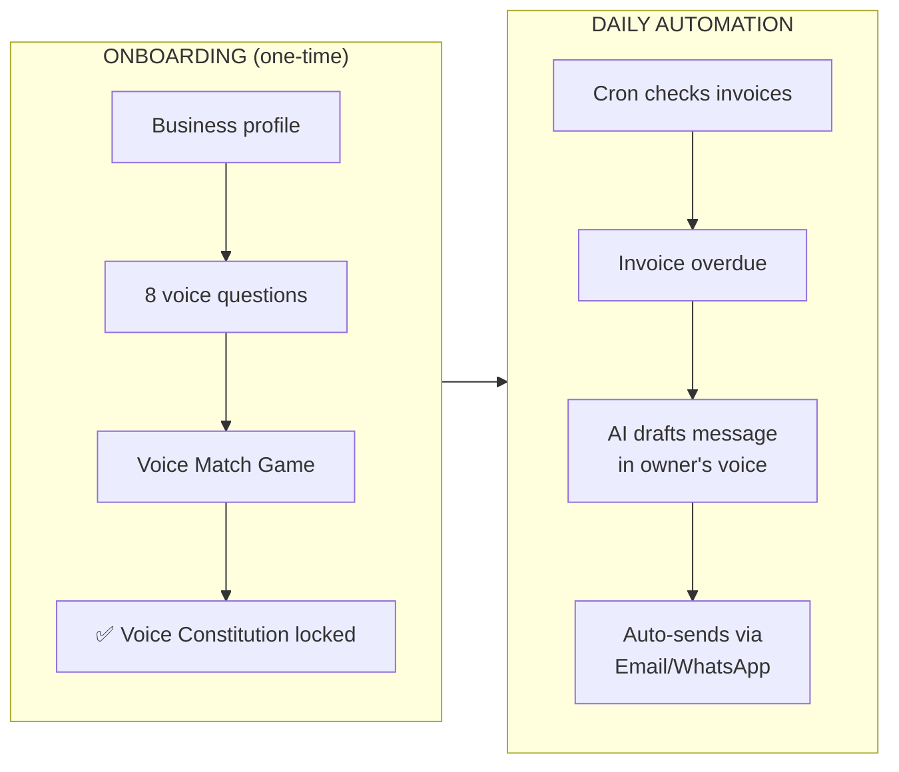
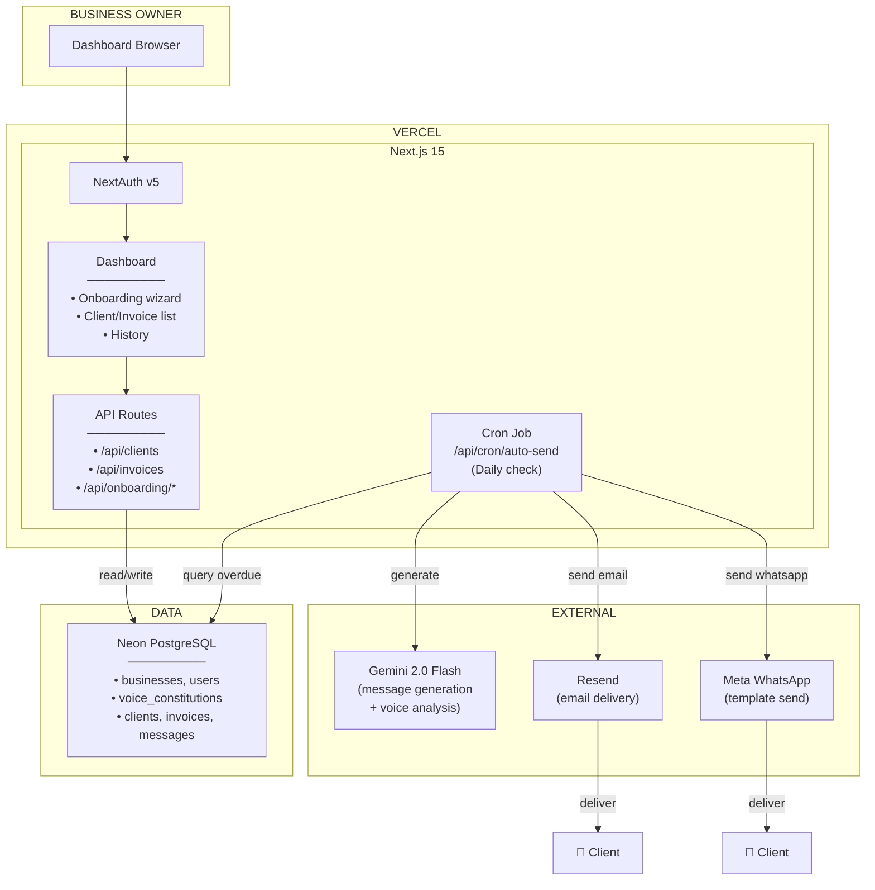

# MIRA — 4-Phase Product Roadmap

> Each phase is a **complete, shippable product**. Deploy it. Get beta users on it. Collect feedback. Then build the next phase on top.

---

## Product Evolution

```mermaid
graph LR
    subgraph P1["PHASE 1"]
        P1T["Brand Voice + Auto-Send"]
        P1D["System auto-sends follow-ups<br/>in the owner's voice"]
    end

    subgraph P2["PHASE 2"]
        P2T["+ Persona"]
        P2D["'Priya' takes over sending<br/>autonomously via email/WhatsApp"]
    end

    subgraph P3["PHASE 3"]
        P3T["+ Behavioral Intelligence"]
        P3D["Full two-way conversations,<br/>subtext reading, escalation"]
    end

    subgraph P4["PHASE 4"]
        P4T["Intelligence Platform"]
        P4D["Cross-client learning,<br/>analytics, network moat"]
    end

    P1 -->|"+ Persona"| P2
    P2 -->|"+ L2, L4, L5, L6"| P3
    P3 -->|"+ Network Intelligence + Analytics"| P4

    style P1 fill:#0c1a12,stroke:#00ffa3,stroke-width:2px,color:#dde2f0
    style P2 fill:#110c1a,stroke:#fa6d6d,stroke-width:2px,color:#dde2f0
    style P3 fill:#1a0c0c,stroke:#7c6dfa,stroke-width:2px,color:#dde2f0
    style P4 fill:#1a170c,stroke:#fac46d,stroke-width:2px,color:#dde2f0
```



| Phase | Core Addition | Product Name | User Experience |
|-------|---------------|--------------|-----------------|
| **1** | **Brand Voice + Auto-send** | AI Auto-Sender | Owner onboards voice. System detects overdue invoices and automatically sends follow-ups in the owner's voice. |
| **2** | **Persona** | AI Business Rep | "Priya" (the AI persona) takes over the auto-sending, establishing a boundary between the owner and the follow-ups. |
| **3** | **Behavioral Intel + Two-Way** | Autonomous Conversations | Clients reply, Priya handles it (negotiation, subtext reading). Escalates only when necessary. |
| **4** | **Network Intel + Analytics** | Intelligence Platform | System learns what works across all clients. Silent evolution and rich analytics dashboard. |

---

---

# PHASE 1: AI Auto-Sender

> **Ship as**: A system that automatically chases overdue payments using the business owner's exact tone and voice.

> **Beta user value**: "I set up my voice once. Now, when an invoice is overdue, the system automatically writes and sends the perfect follow-up message sounding exactly like me."

## What the User Sees



## What Ships

| Feature | Layer | Detail |
|---------|-------|--------|
| Auth + Dashboard | Infra | Sign up, log in, dark-themed dashboard |
| Business onboarding | L1 | 8 questions + MCQs |
| Voice DNA Analysis | L1 | 5-level analyzers (Gemini) |
| Voice Constitution | L1 | Generate, display, lock |
| Voice Match Game | L1 | 5-round A/B calibration |
| Quality Gate | L1 | Forbidden words, greeting/sign-off, length check |
| Client management | Data | Add/edit clients (name, email, phone) |
| Invoice management | Data | Add invoices (amount, due date, status) |
| **Scheduled trigger** | Pipeline | Cron job checks for overdue invoices daily |
| **Auto-generation** | Pipeline | Client + invoice → AI drafts follow-up |
| **Auto-send** | Channels | Sends automatically via Email or WhatsApp |
| Message history | Data | Track all sent messages per client in dashboard |

## What Does NOT Ship (Yet)

- ❌ Persona (no "Priya" — messages come from the owner directly)
- ❌ Inbound reply handling (no two-way conversation)
- ❌ Behavioral intelligence (no coordinate tracking)
- ❌ Memory system (no client memory beyond basic profile)
- ❌ Ethical transparency layer (not needed — owner is sending directly)

## Architecture — Phase 1



## Folder Structure — Phase 1 Only

```
MIRA/
├── .env.example
├── .env.local
├── package.json
├── tsconfig.json
├── next.config.ts
├── drizzle.config.ts
├── tailwind.config.ts
├── components.json
├── docker-compose.yml                    # Local PostgreSQL
│
├── drizzle/
│   ├── schema.ts                         # Phase 1 tables only
│   ├── seed.ts
│   └── migrations/
│
├── src/
│   ├── middleware.ts                     # Auth check
│   │
│   ├── app/
│   │   ├── layout.tsx
│   │   ├── page.tsx                      # Landing page
│   │   ├── globals.css
│   │   │
│   │   ├── (auth)/
│   │   │   ├── login/page.tsx
│   │   │   └── signup/page.tsx
│   │   │
│   │   ├── (dashboard)/
│   │   │   ├── layout.tsx                # Dashboard shell
│   │   │   ├── page.tsx                  # Home: recent messages, pending invoices
│   │   │   ├── onboarding/
│   │   │   │   ├── page.tsx
│   │   │   │   ├── questions/page.tsx
│   │   │   │   ├── voice-match/page.tsx
│   │   │   │   └── review/page.tsx
│   │   │   ├── clients/
│   │   │   │   ├── page.tsx
│   │   │   │   └── [clientId]/page.tsx
│   │   │   ├── invoices/
│   │   │   │   ├── page.tsx
│   │   │   │   └── [invoiceId]/page.tsx
│   │   │   └── history/page.tsx          # Sent message history
│   │   │
│   │   └── api/
│   │       ├── auth/[...nextauth]/route.ts
│   │       ├── onboarding/
│   │       │   ├── questions/route.ts
│   │       │   ├── voice-match/route.ts
│   │       │   └── constitution/route.ts
│   │       ├── clients/route.ts
│   │       ├── invoices/route.ts
│   │       └── cron/
│   │           └── auto-send/route.ts    # 🔑 The auto-send trigger
│   │
│   ├── features/
│   │   ├── ai/
│   │   │   ├── gemini-client.ts
│   │   │   ├── prompt-builder.ts
│   │   │   ├── quality-gate.ts
│   │   │   └── prompts/
│   │   │       ├── voice-analysis.ts
│   │   │       ├── voice-match.ts
│   │   │       ├── constitution-gen.ts
│   │   │       └── message-generate.ts
│   │   │
│   │   ├── voice/
│   │   │   ├── services/
│   │   │   │   ├── surface-analyzer.ts
│   │   │   │   ├── vocabulary-analyzer.ts
│   │   │   │   ├── structure-analyzer.ts
│   │   │   │   ├── emotional-analyzer.ts
│   │   │   │   ├── cognitive-fingerprint.ts
│   │   │   │   └── constitution.ts
│   │   │   ├── components/
│   │   │   │   ├── QuestionStep.tsx
│   │   │   │   ├── VoiceMatchRound.tsx
│   │   │   │   └── ConstitutionPreview.tsx
│   │   │   └── actions/
│   │   │       ├── submit-answers.ts
│   │   │       ├── submit-voice-match.ts
│   │   │       └── lock-constitution.ts
│   │   │
│   │   ├── channels/
│   │   │   ├── channel-router.ts
│   │   │   ├── email/
│   │   │   │   ├── resend-client.ts
│   │   │   │   └── send.ts
│   │   │   └── whatsapp/
│   │   │       ├── meta-client.ts
│   │   │       └── send-template.ts
│   │   │
│   │   └── pipeline/
│   │       ├── auto-send.ts             # Orchestrates generation + quality gate + send
│   │       └── types.ts
│   │
│   ├── lib/
│   │   ├── db/index.ts
│   │   ├── auth/config.ts
│   │   └── utils/
│   │       ├── errors.ts
│   │       └── validators.ts
│   │
│   ├── components/
│   │   ├── ui/
│   │   ├── layout/
│   │   └── shared/
│   │       ├── MessagePreview.tsx
│   │       └── EmptyState.tsx
│   │
│   └── types/
│       ├── voice.ts
│       └── api.ts
│
└── docs/
    └── architecture.html
```

**~40 files. Shippable in 3-4 weeks.**

## Database — Phase 1 Tables

```
businesses, users, voice_constitutions, voice_evolution_logs,
clients, invoices, messages
```

That's 7 tables. No coordinates, no memories, no personas, no conversations.

## Phase 1 — Verification Before Launch

| Test | Pass Criteria |
|------|---------------|
| Onboarding | Complete 8 questions + 5 voice match rounds → constitution generated |
| Voice quality | Review generated messages → owner says "sounds like me" for 8/10 |
| Quality gate | Message with forbidden word → regenerated automatically before sending |
| Auto-send trigger | Cron hits API → overdue invoices correctly identified and processed |
| Email send | Resend delivers auto-generated email to client inbox |
| WhatsApp send | Meta API delivers WhatsApp template to client phone |
| Multi-tenant | Business A cannot see Business B data; cron processes tenants safely |

---

---

# PHASE 2: AI Business Representative (Adding Persona)

> **Ship as**: A named AI persona (e.g., "Priya") is introduced. The system switches from auto-sending in the *owner's* voice to auto-sending in the *persona's* voice.

> **Beta user value**: "I don't want to be the bad guy anymore. I set up 'Priya', and now she sends the automatic reminders. The tone is perfectly calibrated to represent my brand."

## What Changes from Phase 1

- Instead of the owner's voice directly, we load the Persona rules (L3).
- We set up a custom email domain for the persona (`priya@businessdomain.com`).
- We introduce human texture engines to make the persona feel real.
- We add the Persona Constitution (NEVER/ALWAYS hard laws).

## What Ships (on top of Phase 1)

| Feature | Layer | Detail |
|---------|-------|--------|
| **Persona creation** | L3 | Name, role, email, personality traits, constitution |
| **Persona email** | L3 + Infra | `priya@businessdomain.com` — real email via Resend |
| **Persona WhatsApp** | L3 + Infra | WhatsApp Business number for persona |
| **Human texture engines** | L3 | Rhythm variation, vocabulary unpredictability, micro-naturalness |
| **Persona constitution** | L3 | NEVER/ALWAYS hard laws enforced |
| **Namespace isolation** | L3 | BusinessID + ClientID unique key |
| **Domain setup flow** | Infra | DNS verification UI for custom email domain |
| **WhatsApp templates** | Channels | Template management + submission to Meta for approval |

---

---

# PHASE 3: Autonomous Conversations (Adding Behavioral Intel & Two-Way)

> **Ship as**: Clients reply to Priya, and she handles the conversation autonomously. She reads subtext, negotiates, and escalates when necessary.

> **Beta user value**: "It's no longer just a one-way reminder. Priya actually talks to them, figures out why they haven't paid, and gets the money."

## What Ships (on top of Phase 2)

| Feature | Layer | Detail |
|---------|-------|--------|
| **Inbound processing** | Channels | Webhooks to receive Email and WhatsApp replies |
| **Reply classifier** | L6 | 8 types: payment, promise, partial, dispute, delay, etc. |
| **Subtext reader** | L6 | Read between the lines of client replies |
| **5-step response protocol** | L6 | Acknowledge → subtext → forward → door open → voice |
| **Negotiation engine** | L6 | Extensions, instalments within business parameters |
| **Escalation engine** | L6 | Human handoff with complete brief |
| **Signal collection** | L2 | Email opens, reply speed, message length changes |
| **Coordinates** | L2 | Emotional (valence × arousal) + Relationship (trust × warmth) |
| **Ruleless Intuition** | L2 | Full context → Gemini with no rules |
| **Full Memory System** | L4 | Core, Recent, Episodic, Human Detail layers |
| **Ethical Transparency** | L5 | Structural honesty, graceful disclosure levels |

---

---

# PHASE 4: Intelligence Platform

> **Ship as**: The system gets smarter with every conversation. Cross-client learning, analytics, voice evolution, and network effects create an unkillable data moat.

> **Beta user value**: "My AI has handled 500 conversations. It knows which approach works for which type of client. No competitor can replicate this data."

## What Ships (on top of Phase 3)

| Feature | Layer | Detail |
|---------|-------|--------|
| **Resolution Intelligence** | L2 | Score every outcome: Genuine / Coincidental / Painful |
| **Cross-client learning** | L2 | Aggregate: "approach X works at coordinate Y across all clients" |
| **Silent Evolution** | L1 | Owner overrides trigger diff analysis → constitution auto-updates |
| **Trust dividend analytics** | L5 | Proactive disclosure → measure trust impact |
| **Analytics dashboard** | UI | Recovery rates, coordinate distributions, voice evolution timeline |

---

## $0 Tech Stack (All Phases)

| Service | Free Tier | Sufficient Until |
|---------|-----------|-----------------|
| Next.js 15 | Open source | Forever |
| NextAuth v5 | Open source | Forever |
| Neon PostgreSQL | 512MB | ~50 businesses |
| Upstash Redis | 10K cmds/day | ~100 msgs/day |
| Google Gemini 2.0 Flash | 1M tokens/day | ~500 msgs/day |
| Resend | 3K emails/month | ~100 follow-ups/month |
| Meta WhatsApp Cloud API | 250 msgs/day (test) | Development + early beta |
| Vercel Hobby | 100GB bandwidth | ~10K page views/day |
| Sentry Free | 5K errors/month | Until you're printing money |
| **Total** | **$0/month** | **Until ~50 businesses** |

---

## Open Questions

> [!IMPORTANT]
> 1. **Phase 1 send method**: Should "Send via Email" send directly from the owner's email address, or from a platform address like `follow-ups@mira.ai`?
> 2. **Phase 1 WhatsApp**: Do you have a Meta Business account ready for WhatsApp integration?
> 3. **Invoice source**: Will invoices be entered manually in MIRA, imported via CSV, or synced from accounting software (Zoho, Tally)?
